**If you wish to host this tutorial elsewhere please let us know below..**

I have finally gotten around to creating a simple tutorial on how to get lighting effects from 3DSMax 8 into Renegade, some would call this "lightmapping."

When using this and some other tools TT have developed you too can get professional looking shadows, lighting effects... just one thing I should mention, this method is not dynamic lighting, but rather static baked in lighting.

Let's begin.

[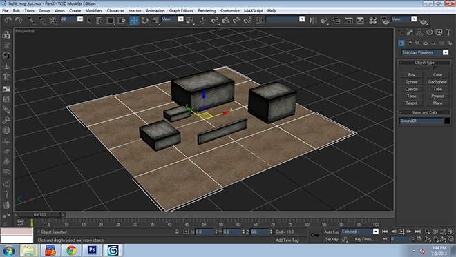](images/Image1.jpg)

Open your completed level, textures are optional, but recommended that the level be completely textured before starting the process. Just easier to render and see the effect the lighting will have on the level.

[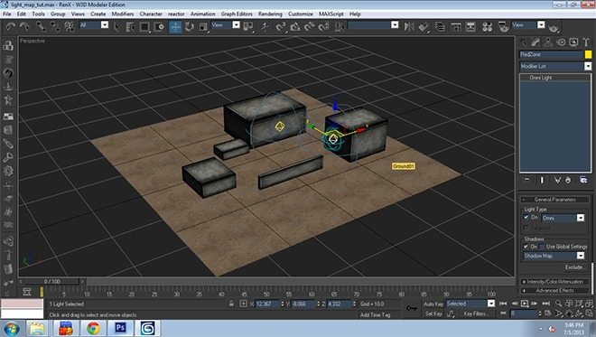](images/Image2.jpg)

Here I have placed some lights and other atmosphere effects to the scene.

[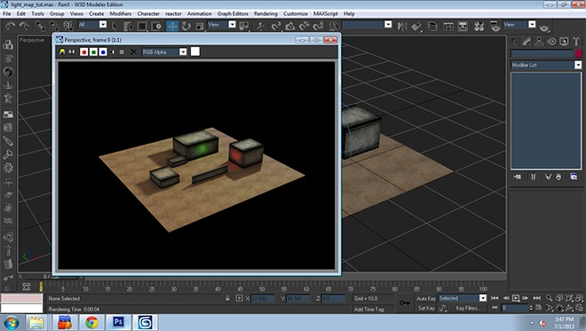](images/Image3.jpg)

Let's render [F9] the scene and check out how the lighting looks, everything looks fine, when you're happy with the final product move on to the next step. **Remember to render often to check for lighting errors or glitches, be sure to look at all surfaces etc..**

[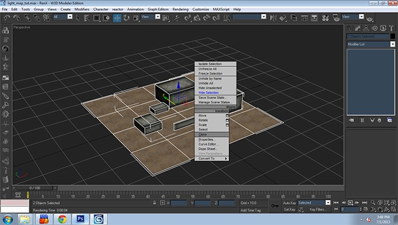](images/Image4.jpg)

Now that our lights are done, let's hide them and just keep the terrain I want to lightmap visible. First thing you want to do is clone all the terrain pieces you wish to apply the lighting to... In my case, it is the concrete boxes and ground. [`Right Click > Clone`]

[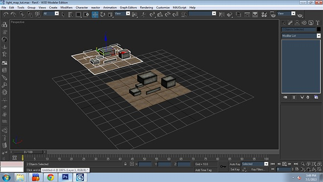](images/Image5.jpg)

Now both pieces are cloned simply move them to the side, leave it there for now, we will work on that in a bit.. As you can see I've moved mine a bit off from center.

[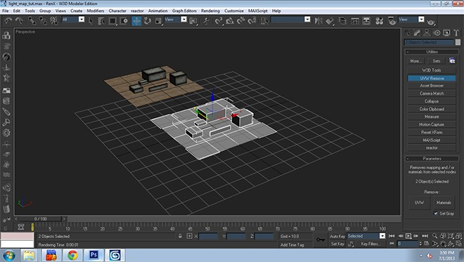](images/Image6.jpg)

Now select the original two pieces and remove the materials from them [`utilities Tab> UVW Remove>Materials` Make sure `Set Gray` is checked]

[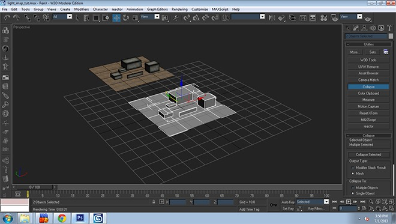](images/Image7.jpg)

With the materials off the original meshes, we need to combine them for the lightmap. [`utilities>Collapse>Collapse Selected`] This will make the pieces into one mesh.

[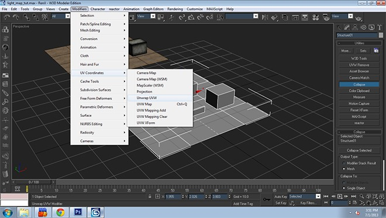](images/Image8.jpg)

Now that it is one mesh, we need to apply a UVW unwrap, select the mesh [`Modifiers>UV Coordinates>Unwrap UVW`]

[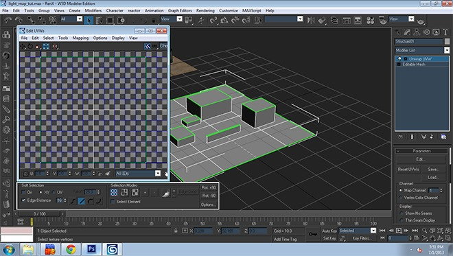](images/Image9.jpg)

Now that it has applied a UV unwrap we need to flatten all faces for the lighting information. **Before moving on set the "Map Channel" to 2, we will need to remember this for later.**

[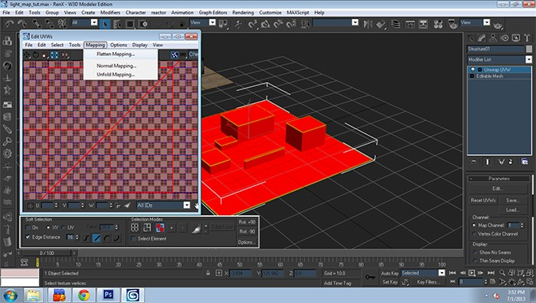](images/Image10.jpg)

Under "Selection Modes" click on the third button to the left "Face Sub-object Mode" then select all faces in the scene [`Ctrl+A`] to select all, then we need to flatten, [`Mapping>Flatten Mapping`].

[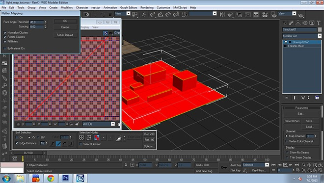](images/Image11.jpg)

Once that is done just use the defaults that are displayed on my screenshot. Click "Ok" when done.

[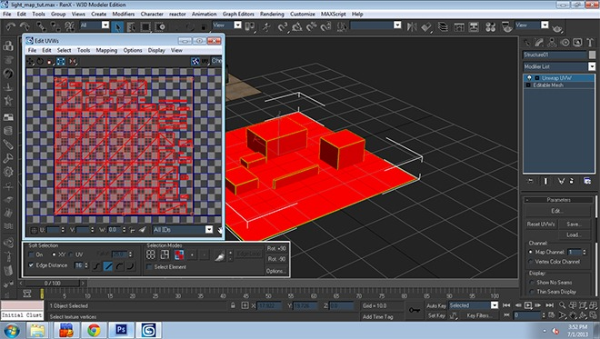](images/Image12.jpg)

The modifier should auto-flatten to something similar to what I got pictured above. Once that is done, move on to the next step.

[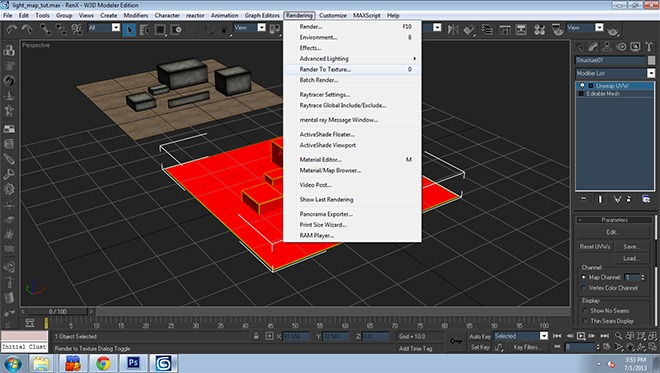](images/Image13.jpg)

Now we need to render the lighting information to a texture, [`Rendering>Render to Texture`]

[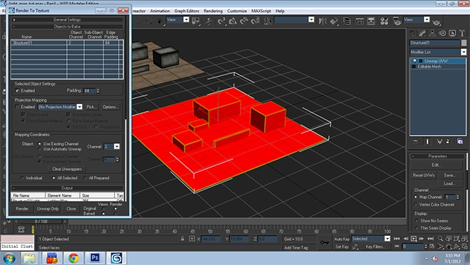](images/Image14.jpg)

This will provide a pop-up of the settings of the texture we will render, set the Padding to 64, Object should "Use existing Channel" then set the channel to 2, we set this channel from earlier...

[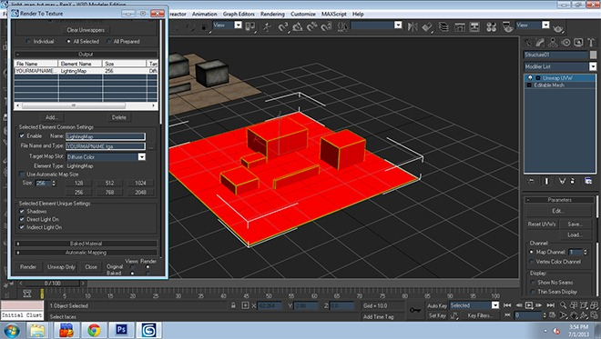](images/Image15.jpg)

Continue down to "Add" button, click on it and select "Lightingmap" after it will provide you with the ability to change the file name and type of the texture output [To change output location click on the " ... " ] **For lightmaps I tend to make them DDS with DXT-1 settings, and use a 256x256 size.**

[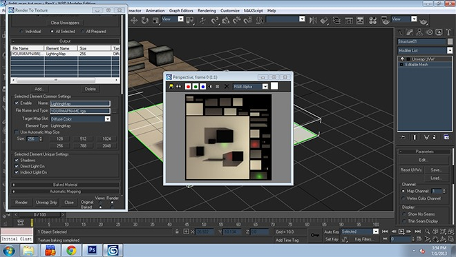](images/Image16.jpg)

Once you are happy with file name and output location press "Render", you should see a pop up with the lightmap texture, something like my lightmap pictured above. Once rendered close the pop up windows.

[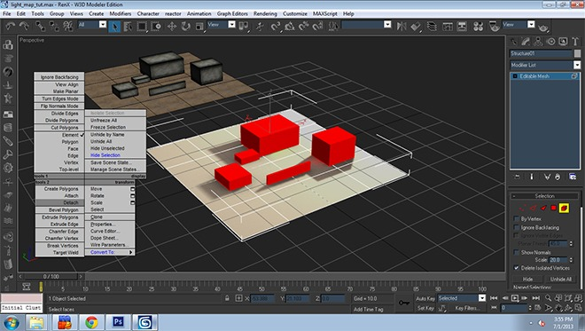](images/Image17.jpg)

Now the lightmap texture is applied to the original mesh, at this point we need to detach the single mesh back into the original two pieces we started with.. [Right-Click on the mesh>Detach with the element tool] Once complete move on to the next step.

[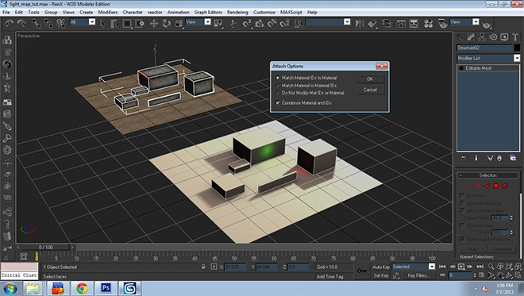](images/Image18.jpg)

Now this is where the cloned copy of the original comes into play, we need to attach the cloned pieces to the lightmapped pieces. Ground>Ground, Concrete Boxes>Concrete Boxes... Once you attach the cloned copy to the lightmap meshes a pop up will appear [Pictured above] leave those default settings and press Ok.

[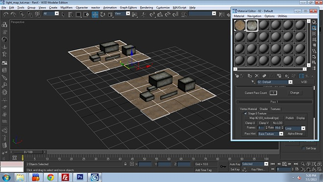](images/Image19.jpg)

Now that the pieces are attached together we need to re-apply the materials over the meshes, once complete move to next step.

[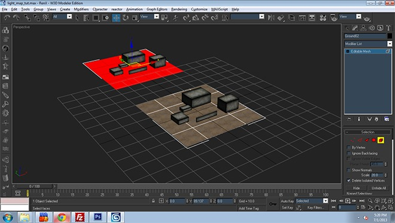](images/Image20.jpg)

Now the two pieces are retextured we need to get rid of the cloned mesh we made earlier [Mine was the top one] just make the mesh editable and select and delete the cloned mesh [Pictured above]

[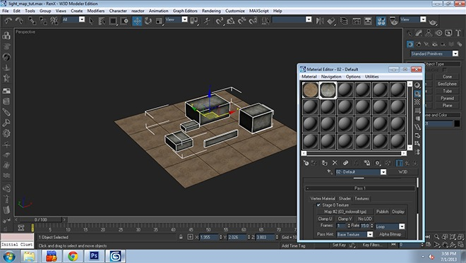](images/Image21.jpg)

We are left with the one piece, now we need to apply the lightmap texture we made earlier to the materials of the Ground and Concrete Boxes.. Go into the material editor [ M ] and apply the next step settings to the materials.

[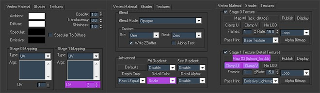](images/Image22.jpg)

- Vertex Tab, Stage 1 Mapping should be set to 2
- Shader Tab, Pri-Gradient set to "Disable", Detail Color to "Scale"
- Textures Tab, Check Stage 1 Texture, and place the Lightmap texture you output earlier here, click on "Clamp U" and "Clamp V"

Once completed close material editor and export your scene into a W3D.

Once all is complete and lightmap textures are applied to the mesh/meshes.. You will need to add a user defined parameter.. Right click, goto properties and goto User Defined tab... There you will see a text box, add the line [ `Prelit=true` ] - everything in between the brackets.. And apply this line to all lightmapped mesh.. This is so that the Renegade vertex lighting system ignores these pre-baked light meshes.

[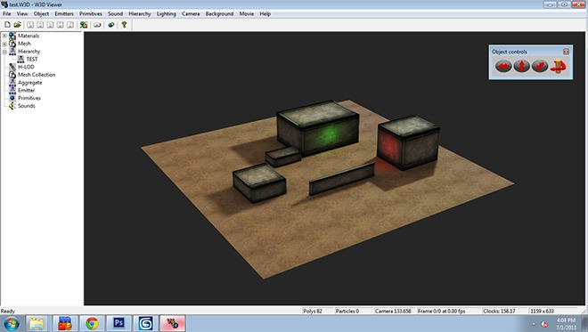](images/Image23.jpg)
[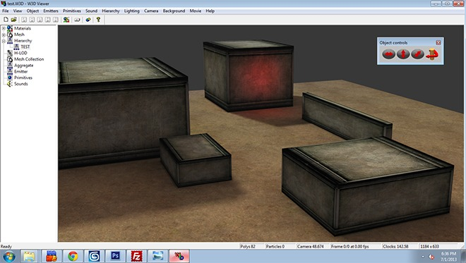](images/Image24.jpg)

Here is my completed level with Lightmap applied in W3D Viewer... Enjoy! and experiment!!

**This is what the model looks like without a lightmap texture and using default vertex lighting instead:**

[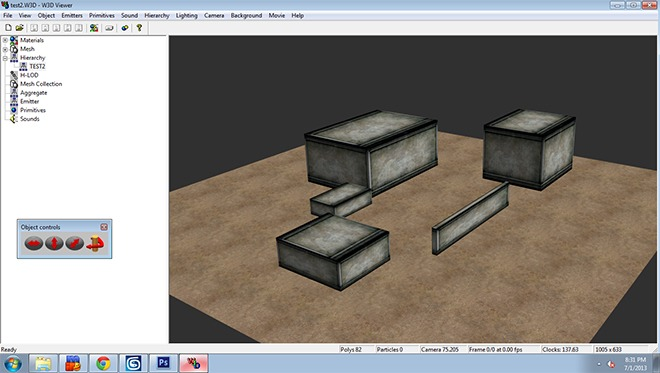](images/Image25.jpg)

Hope you guys learned a bit from this... you can now go and create some cool looking levels with this method of lightmapping I've provided for you... It can get very complex for larger, more detailed levels, so you will need to dedicate quite some time to do it right!

I've only covered the basics on this tutorial, but I'm sure you guys can experiment and achieve more... Good luck and please feel free to post any questions you might have about Lightmapping in this tutorial thread...
