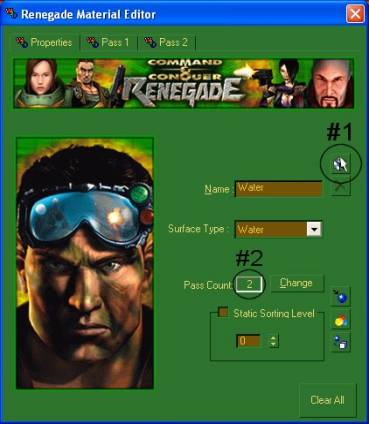
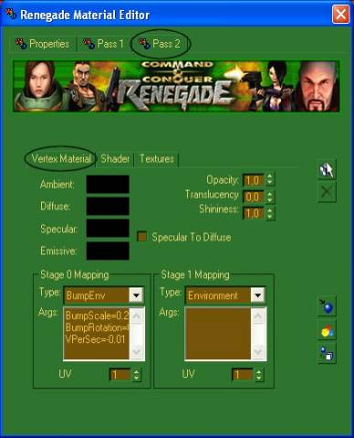
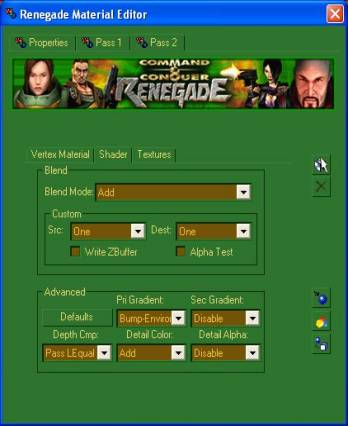
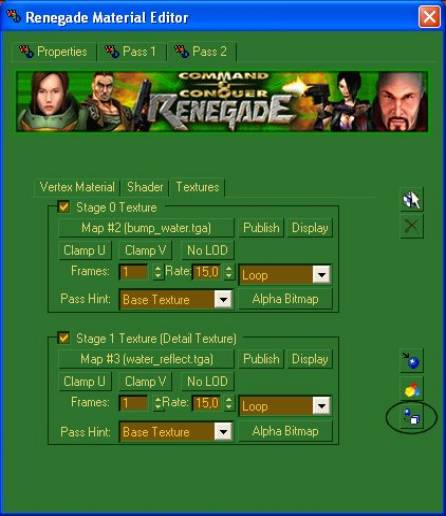
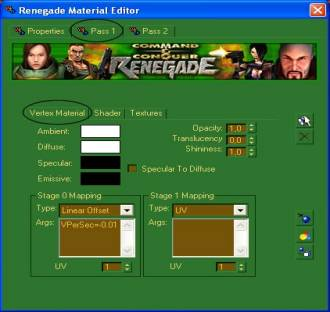
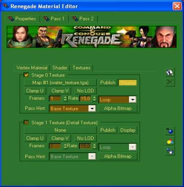
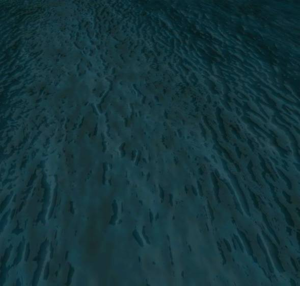

Big thanks to Bumpaneer for allowing this technique to be written up as a tutorial. Let's get started.

## 1. Set Up the Material

1. Load up RenX and make a plane `10x10` or bigger. This is only to get you started, once you learn this tutorial, you'll be able to make water any size you wish.
2. Press **M** on your keyboard to open the **Renegade Material Editor**.
3. Click the blue box icon (**Make New Renegade Material**) to avoid conflicts with a material already used on another object, then change the **Pass Count** to `2` and select the **Surface Type** as `Naturally Water`.

[](images/Image1.jpg)

Ren-X tends to crash if you start on the Pass 1 tab, so move to the **Pass 2** tab first — we'll come back to Pass 1 afterward.

---

## 2. Configure Pass 2 (Reflection Layer)

On the **Vertex Material** tab:

- Make sure **Ambient**, **Diffuse**, **Specular**, and **Emissive** colors are all black.
- Under **Stage 0 Mapping**, set **Type** to `BumpEnv` and fill in the **Args** box with:
  ```
  BumpScale=0.2
  BumpRotation=0.3
  VPerSec=-0.01
  ```
- Change the **Stage 1 Mapping** Type to `Environment` (this makes it reflective).

[](images/Image2.jpg)

Next, move to the **Shader** tab (still on Pass 2):

- Set the **Blend Mode** to `Add`.
- Under **Advanced**, set **Pri Gradient** to `Bump-Environment` and **Detail Color** to `Add`.

[](images/Image3.jpg)

Now move to the **Textures** tab to set up the water's textures and movement:

- Check **Stage 0 Texture**, click **None**, and select [`bump_water.tga`](files/bump_water.tga) (or at [MPF](http://renhelp.multiplayerforums.com/zunnie/RealisticWater/bump_water.tga)).
- Check **Stage 1 Texture** (Detail Texture), click **None**, and select [`water_reflect.tga`](files/water_reflect.tga) (or at [MPF](http://renhelp.multiplayerforums.com/zunnie/RealisticWater/water_reflect.tga)).

[](images/Image4.jpg)

Once Vertex Material, Shader, and Textures are set up on Pass 2, click **Assign Material to Selection** to apply the changes to the object.

---

## 3. Configure Pass 1 (Surface Layer)

Go back to **Pass 1**. On the **Vertex Material** tab, change the **Stage 0 Mapping** Type to `Linear Offset` and add `VPerSec=-0.01` to the **Args** box.

*The Ambient, Diffuse, Specular, and Emissive values are already set up correctly here, so you don't need to touch them.*

[](images/Image5.jpg)

There's nothing to change on the Shader tab for Pass 1, so move directly to the **Textures** tab:

- Check **Stage 0 Texturing** and select the remaining texture from the pack, [`water_texture.tga`](files/water_texture.tga) (or at [MPF](http://renhelp.multiplayerforums.com/zunnie/RealisticWater/water_texture.tga)).
- Check **Display**, then click **Assign Material to Selection** once more to finish.

[](images/Image6.jpg)

---

## Finished Result

That's it — enjoy your new realistic water.

[](images/Image7.jpg)

If you want to build more realistic effects for Renegade, use **WDump** (included with the Renegade Mod Tools) to inspect any W3D's texture settings, so you can duplicate any effect Westwood used on their own maps.

Realistic Water technique developed and improved by **Bumpaneer** and **StoneRook**. Tutorial written by **André**.
