VIS Tutorial

By Pwn Call

---

## Intro

First I recommend that you read through this whole tutorial before you start it as well as the comments on the following pages. That way you can see why you need to do things a certain way and it may be different for your type of map. This way you can fix the issue early before you are too far into to it.

VIS is a system that Westwood created that allows for better FPS when playing Renegade. The basic principle behind VIS is that it allows your computer to only load what is visible in that specific map from where you are located. So for example if you are inside one of your buildings it won't bother to load the interiors (and most likely the exteriors) of the enemy base because they aren't in your line of view.

I learned how to do VIS from YSL Muffins' original VIS tutorial which can be found [here](http://renhelp.laeubi.de/tutorial-vis-tutorial.html). This tutorial is quite in depth but can be quite confusing as well so hopefully mine is a little less confusing while still explaining it well. Also I use one of his pictures in my tutorial so credit goes to him.

---

## Step 1 - Create your level

Usually I like to make my level first then add my VIS sectors at the end, you can add them as you go if you want but I think it gets more confusing that way. Also you should only set up the sectors in Level Edit once you are done with everything else, otherwise things can get messed up easily.

[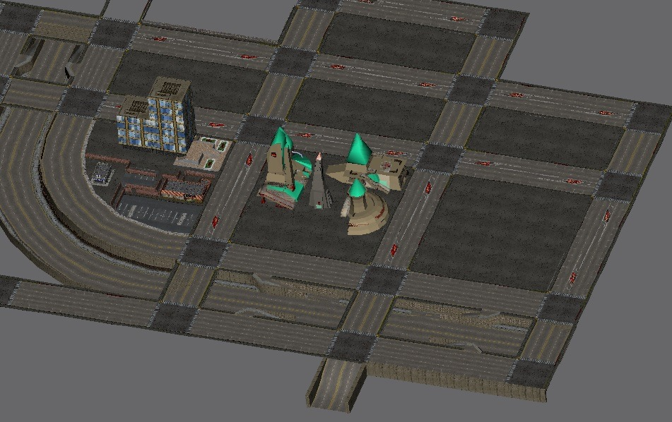](images/Image1.jpg)

## Step 2 - Determine which type of sectors will work best with your map type

If your map is:

- **Flat** - Use the plain sectors as shown in this tutorial for the entire thing, also make sure you add them for lower or higher levels of terrain, for example the tops of high rise structures or other high or low places you can get to.
- **Very Hilly terrain** - Use the method to create sectors where you clone your terrain, and detach several vertices at a time. This will take much more time but works much better with hilly terrain, allowing for much fewer VIS glitches later on. Also make sure to look closely for VIS glitches around the really steep parts of your map.
- **Mostly flat with some steep hills** - Use the flat plain method for the flat parts of the map and use the clone terrain part for the hills.

## Step 3 - Create your VIS Sectors

Alright here we go! So VIS sectors are basically meshes that lie below the surface of your map and you must create a VIS sector anywhere the player's camera can reach. For example when you are in first person mode the camera is exactly where the player's head is, however in 3rd person mode, or more importantly when you are in a vehicle, the camera is somewhere above and behind the player. So with that being said you don't only have to put the sectors anywhere your player can go, but also off the edges of the map where the camera may be.

So look in this next example of me making my sectors for my map, they might not need to be that far off the sides but it is better to make them further off rather than not far enough off because it will give you hassles later on. Also I use a standard plane with 1 segment to keep polys low and I believe the size I used was 25x25 meters. I wouldn't go much bigger than this with your sectors or a whole lot lower, it also depends on the size of your map.

[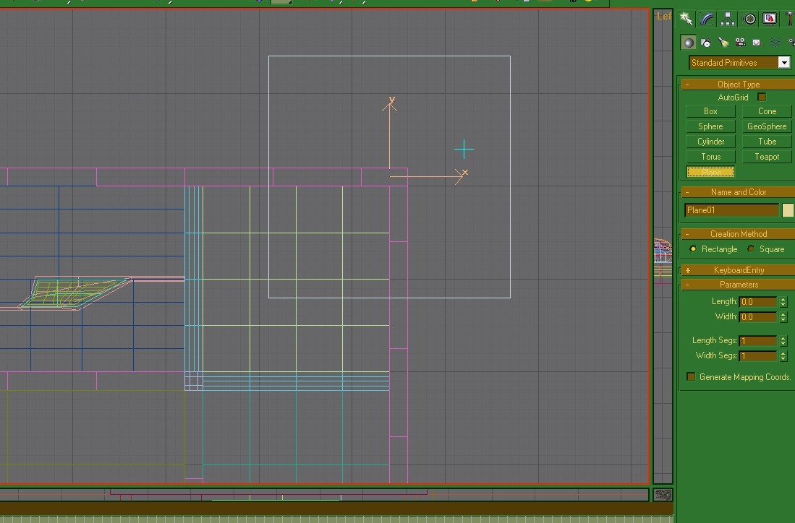](images/Image2.jpg)

Another important thing to do is to name your sector, I usually call the first one I make VIS and then when you clone it it will name the next one VIS01 and so on. This way you can select them all easily later because they will go under all of your terrain.

[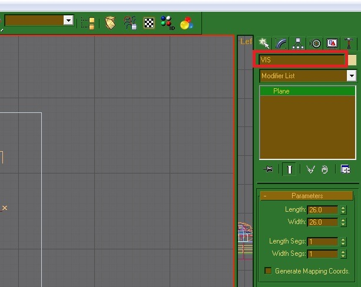](images/Image3.jpg)

Now before you start cloning them all over your map make sure you lower them on the between about 1 and 1.5 meters.

[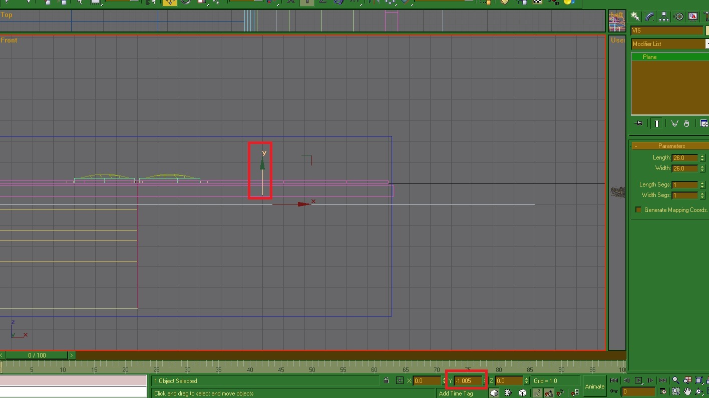](images/Image4.jpg)

Then clone it.

[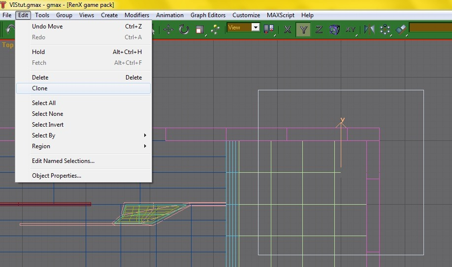](images/Image5.jpg)

And repeat until you have the VIS sectors cover all of your terrain like so. It is extremely useful to use the Grid tool for this so it is easy to line them up, if you don't know how to use the Grid there is a tutorial I made [here](https://multiplayerforums.com/index.php?/topic/1249-level-edit-renx3ds-max-hints-tips/).

[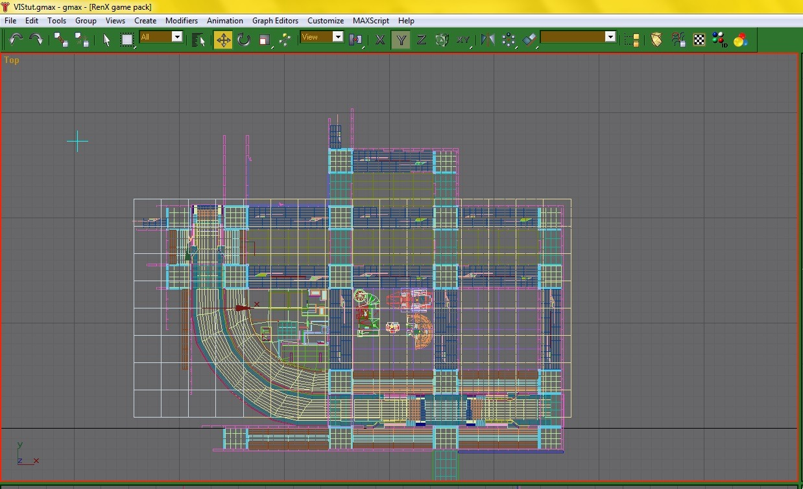](images/Image6.jpg)
[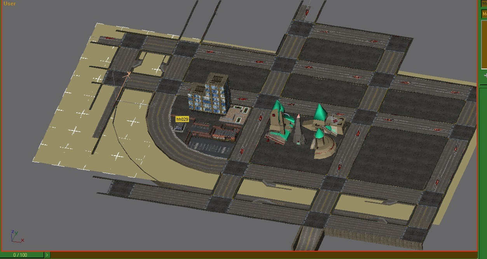](images/Image7.jpg)

Also remember this map I am doing is all flat so planes work well for this. For most maps which are not flat you will have to create your VIS sectors a little differently. The best way to do it is to clone your floor terrain and lower it. Once you lower it you will have to select several vertices at a time and detach them until you have all of the sectors separated. Don't forget to lower it! It also helps if you do this before you texture it but it isn't necessary.

Now not only do you have to do this for your terrain it has to be done anywhere where your character can get to. For example you can see White Nyte's here which is walkable so I have to make a sector for this like so.

[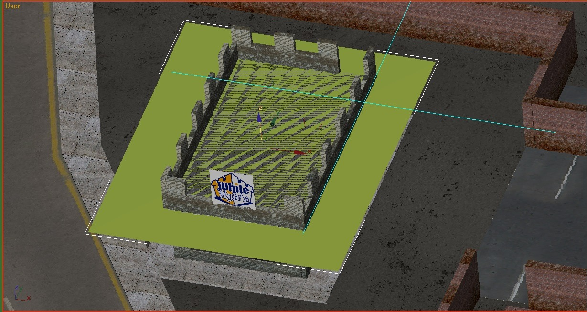](images/Image8.jpg)

And don't forget to lower it!

[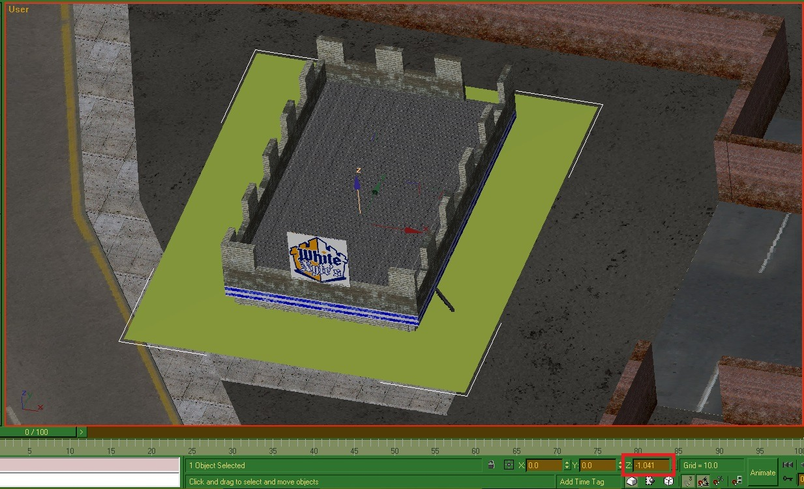](images/Image9.jpg)

Now you don't have to put VIS sectors on everything, just things that are much higher or lower than the existing sectors. For example the top of White Nyte's is most likely too high for the sector and the ground to be effective, that is why I am adding on for the roof of the building. But smaller things like curbs or rocks that you can go on are low enough that you don't need to make a different sector for. I believe a sector works 10 meters above it but remember it is 1 meter below the ground and the camera can go up higher than your character or even higher in vehicles. Test it out and see what works best for your terrain.

Also the renegade buildings come with their own VIS sectors built in so you don't need to add them to the buildings.

## Step 4 - Exporting

Before you export there is one more thing you have to do. First select all of your VIS sectors. Do this by selecting them by name which is really easy (if you named them VIS like I told you to earlier)

[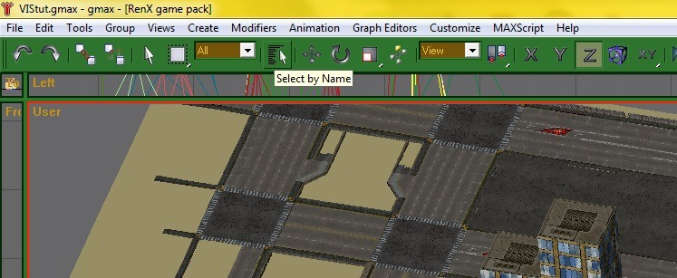](images/Image10.jpg)
[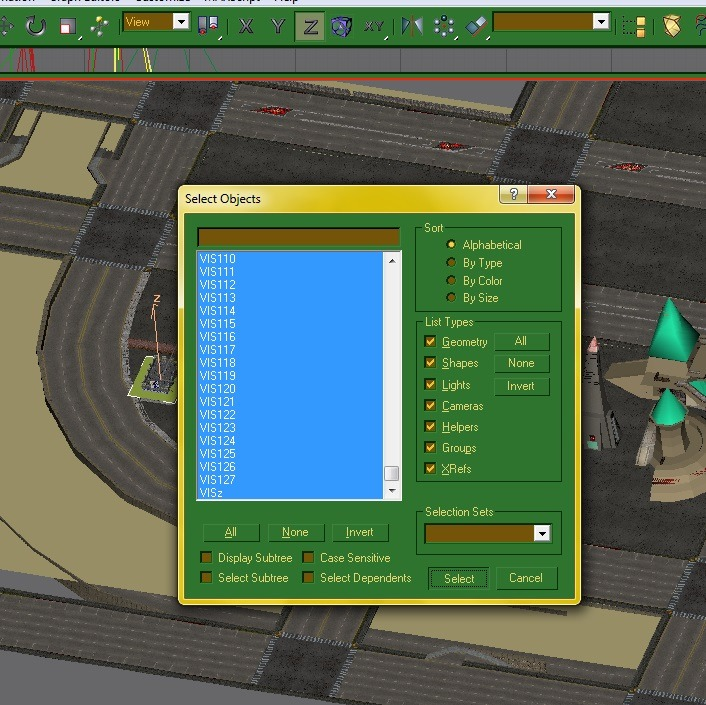](images/Image11.jpg)

Now we have to set the W3D options of the VIS sectors. With them selected click on the Hammer icon on the upper right of your screen, then W3D Options. Then check off both hide and VIS under the collision settings. This allows your VIS sectors to be invisible but still work. They won't disappear in Gmax but they will be gone in LE.

[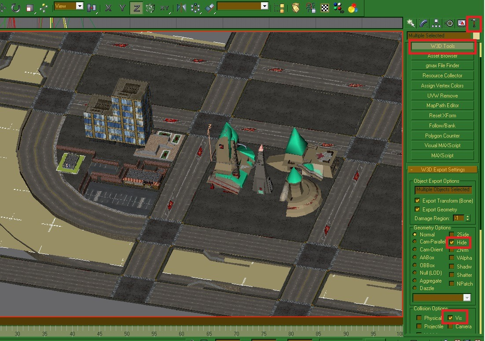](images/Image12.jpg)

Alright now you are good to export your map to Level Edit.

## Step 5 - Level Edit Set Up

So now you should have exported your map with all of your sectors into Level Edit. First I would make sure you set everything else up in Level edit like buildings, waypaths, presets, etc. Also you have to have a Pathfind Generator somewhere on your map to set up the VIS or else Level Edit will crash when you set it up.

[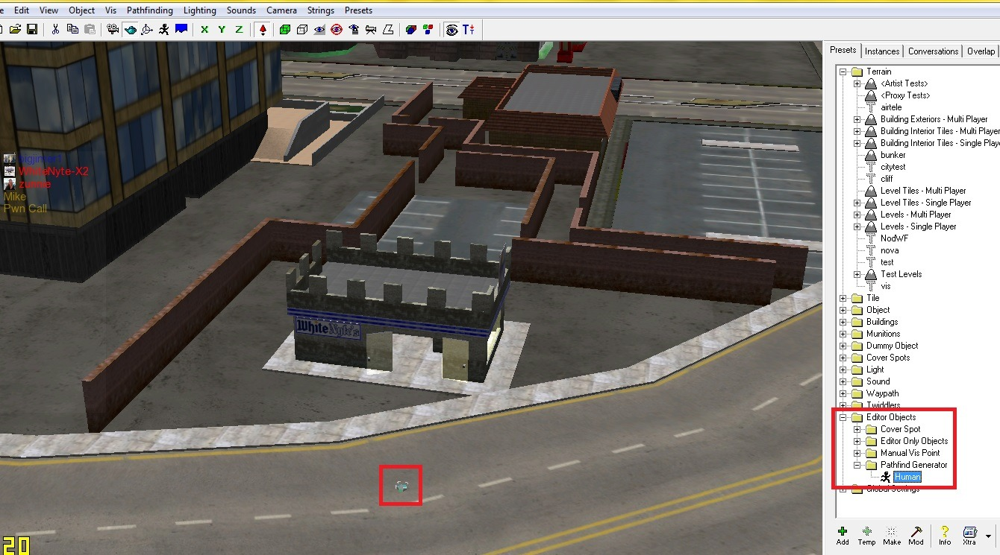](images/Image13.jpg)

Now to start setting up you must do these 4 things in this order. The last 2 will take a while because it is creating all of the VIS points, and make sure you set the granularity to about 5, if you go any lower it takes a TON of time. If you have a crappy PC I recommend 8, you will just have to add more manual VIS points later.

[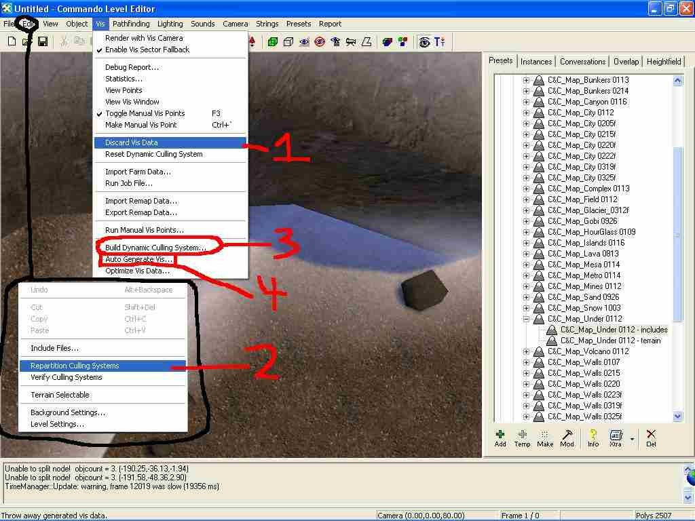](images/Image14.jpg)
[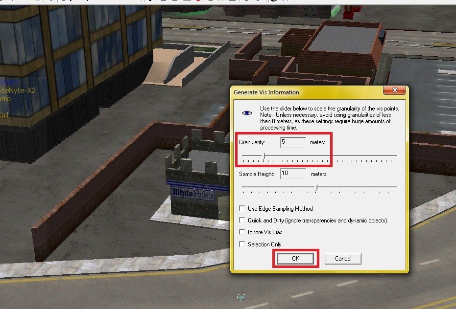](images/Image15.jpg)

Alright that took a while! Now you are almost done. Now what you have to do is walk around and look for VIS glitches. A VIS glitch is where the system thinks you cannot see an object so it won't load that object when in reality you should be able to see it. It looks something like this...

[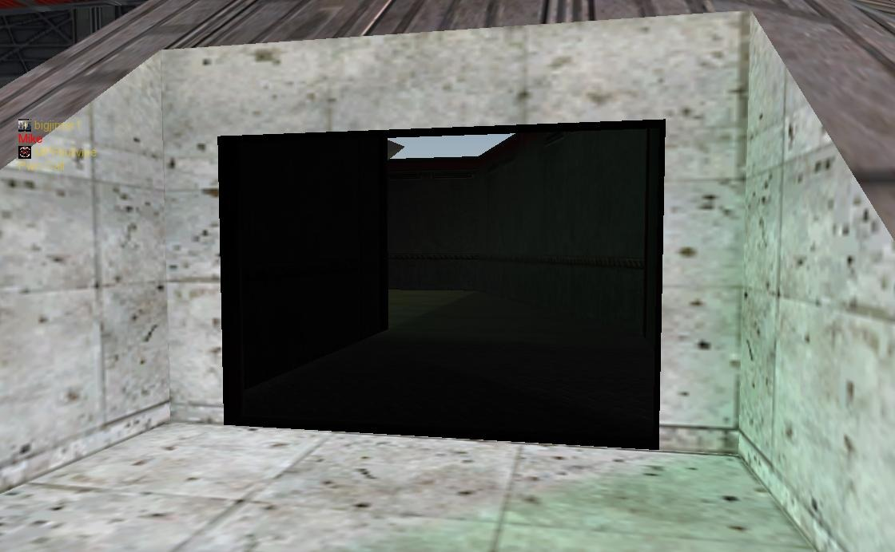](images/Image16.jpg)

That is the inside of the refinery and there is a mesh there covering up that hole but it doesn't think you are supposed to be able to see that mesh. So what you must do is create a manual VIS point. To do this just hold down the control key and hit the accent button which has these symbols on it ` and ~ (left of the 1) so Ctrl+`. Once you do that it should fix the VIS glitch and make that mesh or object reappear. If it doesn't reappear try moving around or moving the camera around slightly and try it again, some VIS glitches are stubborn! Some cases if it can't be fixed it may be because there isn't a VIS sector in that location and in that case you need to go back to RenX and fix it.

Common places to look for these VIS glitches are as follows: Most of the Renegade buildings have them especially in and around the doorways, the hand of nod by the ped area windows has a ton of them so look there very thoroughly or add your own sectors to that spot, entrances and exits to tunnels, areas that have really steep slopes, corners, etc.

Also for finding ones around doors you can hit Ctrl+Shift+T which will hide the doors. Note that this also hides all tiles like trees or other objects you have made in your level, so once you are done around the doors hit Ctrl+Shift+T to make them reappear.

Once you make a manual VIS point it will appear in LE like a little camera to show where you have them.

[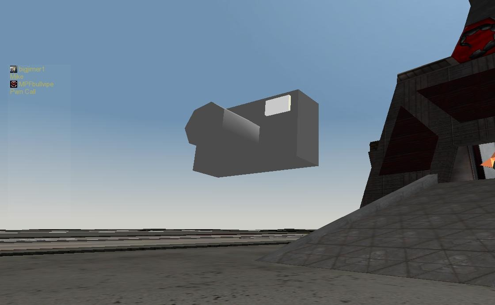](images/Image17.jpg)

Now walk all over your level and look for them, it is easier to find them in 3rd person mode because the camera swings wider so you will have more luck finding them.

After you walk around the whole level and find them all you can do it one more time only with tanks viewpoint. Do this by going to the Camera tab then choose the Mammoth Tank.

[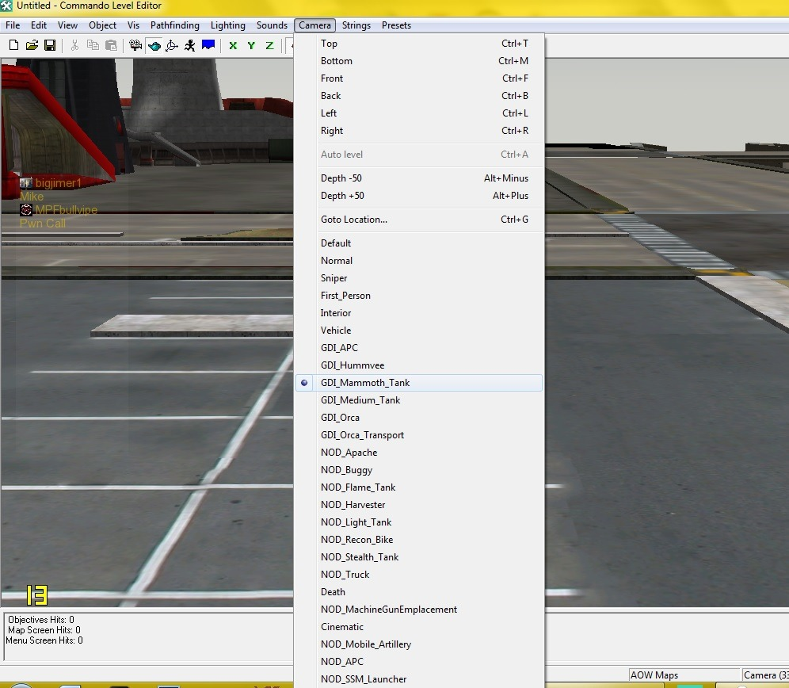](images/Image18.jpg)

This should make your view look somewhat like this

[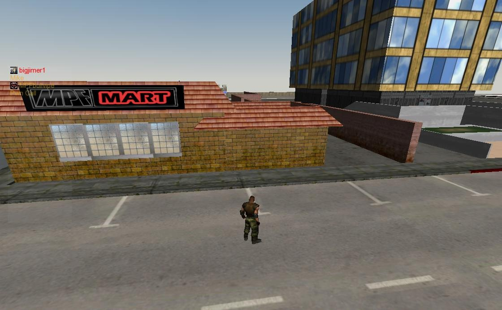](images/Image19.jpg)

Now when you are going around in this view you don't have to go anywhere a tank couldn't go. Also use the Mammoth tank because it has the widest turn radius for the camera. Really check the edges of your map and around buildings well cause these are places that are prone to VIS glitches.

---

## Flying Maps

For flying maps you have to have more than just the VIS layer under the ground, every 9 meters or so in height you need to add another layer until you reach the flight roof. That is really the only difference for flying maps.

---

This is a very confusing tutorial for those of you who are new to VIS, so ask any questions you have below and I will help to answer them. Also if you know more about VIS than me let me know if I did something wrong or if there is a better way to do something!!!
