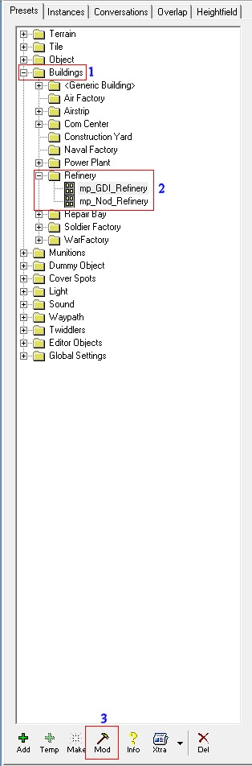
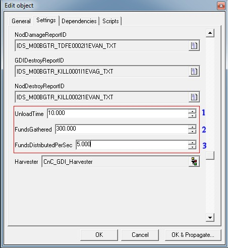

With this method you can easily change the properties of a Refinery serverside like the credits/sec you get, how much money you get per dump and how long it takes the harvester to dump its tiberium.

Startup your LevelEditor and expand the folder (1) "Buildings", then expand the folder (2) "Refinery", there select either the `mp_GDI_Refinery` or `mp_Nod_Refinery`.

Then goto the bottom of your LevelEditor screen and click the (3) "Mod" button once:

[](images/Image1.jpg)

Once you pressed the "Mod" button you will be presented with this mod-dialog-box below. Goto the Settings Tab and scroll way down:

1. Sets the time it takes for the harvester to unload at the Refinery, set to 10.000 for 10 seconds for example
2. Sets how much money you get when the harvester is done dumping, default is 300.000 for $300
3. Sets the amount of money you get every second when the Refinery is alive, set to 5.000 to get $5 a second or any high you want

[](images/Image2.jpg)

I hope this helps you with whatever you are doing.

Note that this is 100% serverside and you can just save the presets when you exit LevelEdit, then goto your presets folder and rename `objects.ddb` to `objects.aow`.

Then load `objects.aow` in `tt.cfg` with for example the following configuration:

```
gameDefinitions:{
	Field:
	{
		mapName = "C&C_Field";
		serverPresetsFile = "objects.aow";
	};
};
rotation:[
	"Field"
];
downloader:{
	repositoryUrl = "http://ttfs.ultraaow.com/";
};
```
