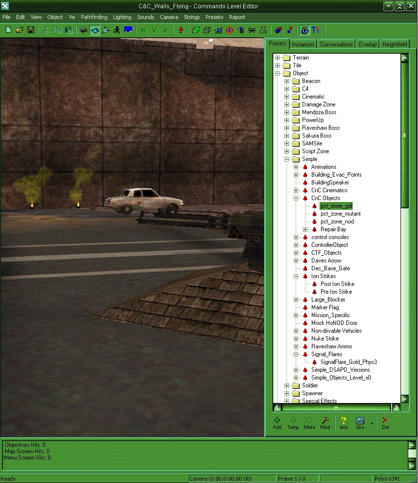

How to create a Serverside mod

First of all you need to load your map like Walls_Flying. Then create some easy things on your map like: "ladders, Signalfires, or Guard Towers, and Nod_Turrets." (see image) Please remember that not everything is working...

Then save the map & goto the Level file of the map where you saved it (e.g. `C:\RenegadePublicTools\LevelEdit\C&C_Walls_Flying\Levels`).

Grab the `c&c_walls_flying.ldd` (only the `.ldd`, the `.lsd` could crash the server) and copy it to the RenegadeFDS data file. If a `.thu` file of the map is there, delete it.

Start the server and all should work fine.

**Greetz UESir28**
