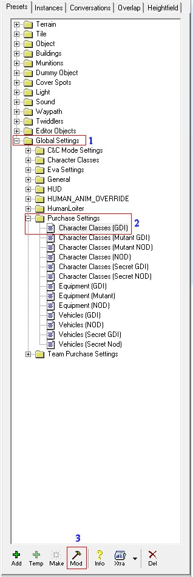
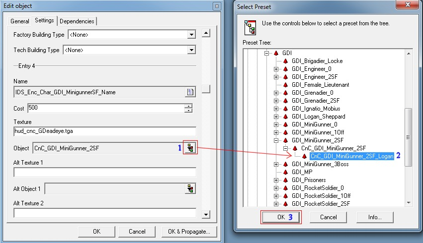

Always wanted to have this special feature on your server where players can buy a Logan instead of a default Sniper on GDI?

This tutorial explains how to do just that. Of course you can apply this knowledge to any other character in the purchase menu as well.

First of all open your LevelEditor and then expand the category (1) "Global Settings", then expand (2) "Purchase Settings" and click on the "Character Classes (GDI)" and finally click on the (3) "Mod" button at the bottom of your LevelEditor:

[](images/Image1.jpg)

Once done, you are presented with a mod edit screen like the image below.

First click on the "Settings" tab and then scroll down until you see "Entry 4" which is for the Sniper on GDI.

It has a weird name, blame Westwood for that. Click on the little colorful button at the right which I labeled a blue "1".

Then proceed and click the "+" in front of the presetname `CnC_GDI_MiniGunner_2SF`, a new entry lists with `_Logan` added to it. Select that preset at the blue "2".

[](images/Image2.jpg)

Now press OK and you're done.

Save the presets by exiting the LevelEditor and choosing Yes when it asks to save the presets.

Then goto your presets folder and rename `objects.ddb` to `objects.aow` and load that in your `tt.cfg` of your server.

Example `tt.cfg` to load a custom modded `objects.aow` file:

```
gameDefinitions:{
	Field:
	{
		mapName = "C&C_Field";
		serverPresetsFile = "objects.aow";
	};
};
rotation:[
	"Field"
];
downloader:{
	repositoryUrl = "http://ttfs.ultraaow.com/";
};
```

Now when you start your server players who buy the GDI Sniper will actually get the GDI Logan to snipe with.

**Greetz zunnie**
