**Make your own Building:**  
a Step by Step to create a full functional building like the Westwood ones.

**Important!! Read this tutorial carefully.  
If something didn’t work as you have expected it, check the corresponding part of the tutorial if you have not missed a thing.**

---

## 1. Prepare Your Building
First of all, of course you need your building. I used for this tutorial the Atreides Weapon Factory for the Battle for Dune Mod.  

It is important that you move your whole building to the center of RenX.  
You also should already have set up all collision settings.

---

## 2. Name Exterior Meshes
Now select all the meshes that are part of the **EXTERIOR**. This should be all parts of the exterior of the building, excluding any emitters, animations or doors.  
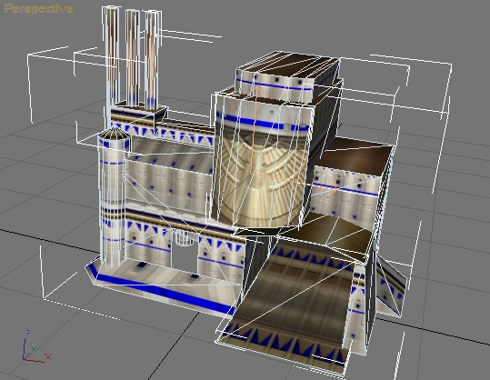

Then go to the **W3D-Tools → Assign Node Names** menu:  
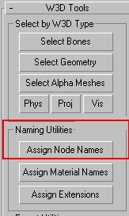

In the dialog, uncheck/check the options as shown, and in the **Root Name** entry put a short name, e.g., `atrwep` (for Atreides Weaponfactory) followed by a `^`.  
You should write this down — you’ll need it later. I’ll refer to this name as the **Meshprefix** later.
> **Important:** The Meshprefix should **NOT exceed 6 characters.**  
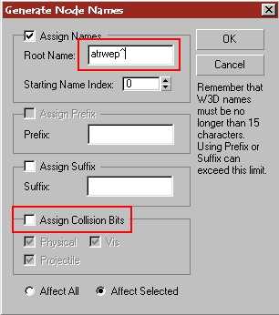

---

## 3. Group the Exterior
Congratulations — you have now created a building’s exterior.  
Now go to **Group → Group** and enter a name (for example, `wep_ext`).  
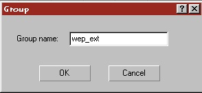

---

## 4. Prepare the Interior
Now hide your exterior group and unhide all parts of the interior (again excluding any emitters, animations or doors).  
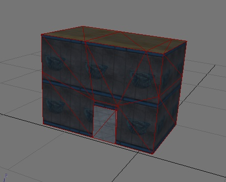

Select all those interior meshes and open the same naming dialog. Enter the Meshprefix followed by a `#`.  
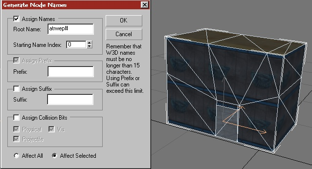

Then group them (for example, call the group `wep_int`).  
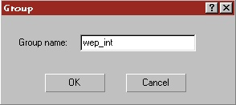

---

## 5. Doors and Emitters
Now we will add the doors and emitters (if you have not already done so).  
If you're using the standard Renegade doors, their preset name is `mpdr_0`.  
Create a 1×1×1 box in Top View at the position where the door should go, name it `mpdr_0~` (or whatever your door preset name is + `~`). For multiple doors, add `00`, `01`, etc. after the `~`.  
Group the doors, for example `wep_doors`.  
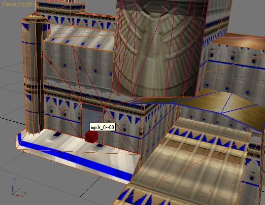

For damage emitters: extract or download `.w3d` files (example: `e_19_fire1.w3d`) and the emitter texture (`e_master01.tga`).  
Use XCC Mixer to extract them.  
Create three 1×1×1 “DamageBoxes” named: `emitter0`, `emitter25`, `emitter50`, `emitter75`.  
Then create three 1×1×1 “EmitterBoxes” named after the emitter file (without `.w3d`).  
**Important:** Never simply rename the emitter file — re-export it from w3d-Viewer or Renegade may crash!  
Now link the EmitterBox to the DamageBox emitter75 if this emitter should be shown at the state for when the building is 25% damaged, emitter50 for half damaged, emitter25 when the building is damaged by 75% and emitter0 when the building is destroyed. 

Use the Link tool and click and drag from your EmitterBox to your DamageBox (The damage box will flash for about 2 sec when this is done successfully).

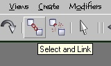
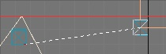

Then place all around your building emitters or objects that should be displayed at the different states and link them to the coresponding DamageBox.
I recommend to save your work now if you have not done this before!!

---

## 6. Animate Visibility Tracks
Now we must make an animation, so Renegade later know what parts must be showed at the damage states.

Reopen **RenX Trackview** (restart RenX if needed):  
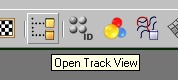

In the Trackview, browse to **Objects → emitter75**:  
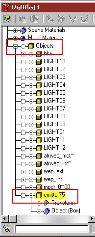

Add a *visibility track* (click the eye icon):  
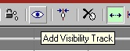  
You should then see a new option.  
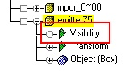

Add keys at frames 1, 2, and 3 using the *Add Keys* button:  
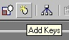  
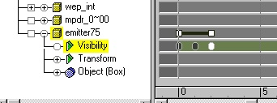

Set the first key’s value to 0 (invisible), the second also to 0, and the third to 1 (visible):  
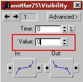

Repeat for all other damage boxes, using these framing schemes:

- `emitter50`: keys at frames 1, 4, 5
- `emitter25`: keys at frames 1, 6, 7
- `emitter0`: keys at frames 1, 8, 9

Optionally, prepare PT and MCT:

- Your PTs and MCT can have also animations like the damage emitters. 
- For the PTs you might want to add animations for a powerless building like westwood does. 
- For this just create four more emitter boxes( `emitter0p`, `emitter25p` and so on) and count up the last frame by one for each state like you have seen in Section 6.
- Select all MCT Meshes and use the naming tool that is described in Section 2, and use as a basename the meshprefix#mct (e.g. atrwep#mct). 
- Repeat this for the PTs also but use `meshprefix#pt` here (e.g. `atrwep#pt`) Group all your PTs and the MCT to a seperate group, e.g. `wep_pct` and `wep_mct`

---

## 7. Export Models for Leveledit
Now export all parts for use in Leveledit:

| Part | Filename / Purpose |
|---|---|
| Interior group | `meshprefix_int.w3d` (Terrain) |
| Doors group | `meshprefix_doors.w3d` (Terrain) |
| Damage + Emitters | `meshprefix_dam.w3d` (Animated Model) |
| MCT group | `meshprefix_mct.w3d` (Animated Model) |
| PT group | `meshprefix_pt.w3d` (Animated Model) |

Example: if your prefix is `atrwep`, you get:  
`atrwep_int.w3d, atrwep_doors.w3d, atrwep_dam.w3d, atrwep_mct.w3d, atrwep_pt.w3d`  
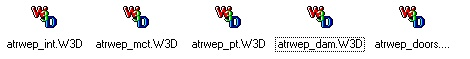  
Place them in your mod folder (e.g. `buildingparts`).  
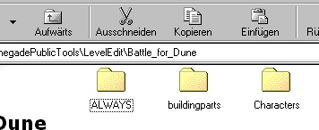

---

## 8. Prepare Exterior For Maps
Create a 1×1×1 box in Top View at the *exact center* of RenX / Gmax. Name it `meshprefix_int~`.  
Clone or create more boxes named: `meshprefix_doors~`, `meshprefix_dam~`, etc.  
Enable **Hide** and **Aggregate W3D** on those boxes:  
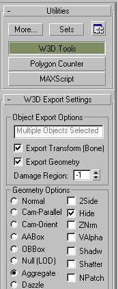

Select your exterior mesh + these boxes and group them (e.g. `AtreidesWeaponfactory`). Save, then merge into your map as terrain.

---

## 9. Setup in Leveledit
Open Leveledit → Load your mod package.  
Go to **Terrain → Add**, name the group (e.g. `mybuildings`)  
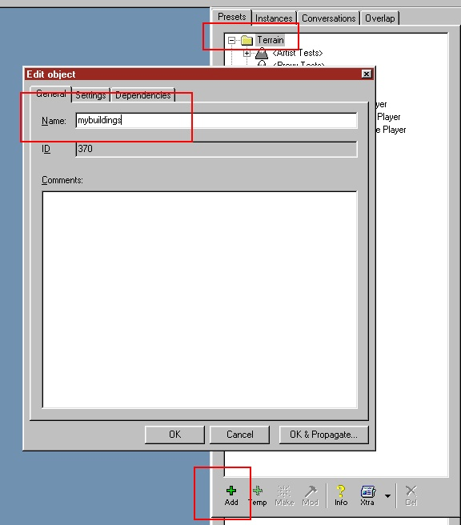

Select this new group and press again add. Enter as name `meshprefix_doors` (e.g. `atrwep_doors`) and under the settings tab under `m_Modelname` select your `_doors` w3d file:  
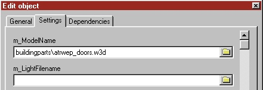

Repeat for `meshprefix_int`:  
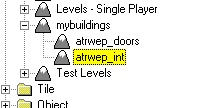

In **Tiles** tab → Add → name: `mybuildingtiles`, set Physics Type to `BuildingAggregate`:  
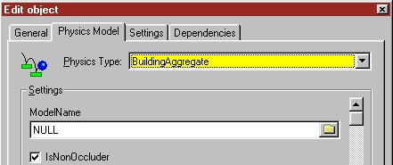

Select this new group and once again press add, enter as name: `meshprefix_dam`, under the Physics Model be sure that the type is `Building Aggregate`, change the Model Name to your corresponding w3d file, the `AnimationMode` to `Manual`:  
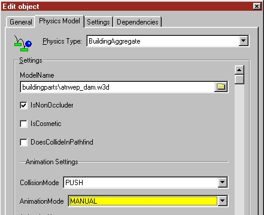

Scroll down to the Building Behavior Settings and change the following:
- AnimLogicMode = `ANIM_LOGIC_SEQUENCE`
- Damage-state mapping:
    - 75% → seq 1
    - 50% → seq 2
    - 25% → seq 3
    - Destroyed → seq 4  
      Repeat for “Power OFF” state too.  
      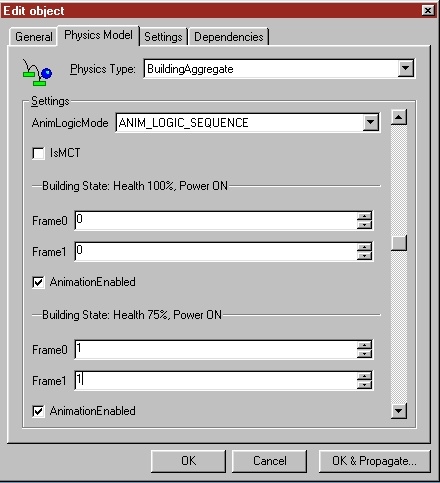

After that press OK, again use the add, now enter as name: `meshprefix_mct` (e.g `atrwep_mct`), select the needed w3d, setup everything like before, but check the checkbox labeled `IsMCT`.
If your MCT also has animation sequences, you must set them up corresponding to your animation as described above.  
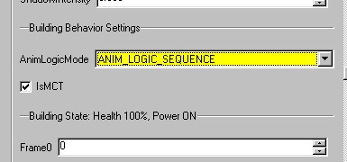

Again add another tile, name it `meshprefix_pt`, set it up as explained for the MCT, but let the `IsMCT` unchecked.

After that, you should have three tiles under your `mybuldingstiles` group: mct, pt, dam.  
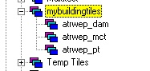

---

## 10. Add to Map & Building Controller
You are finished now. Add your Building Group you have created in part 9 to your map via the `MERGE` command in RenX/Gmax, export it as Renegade Terrain and enjoy your bulding.

To make your building work in game you have to Clone via the ADD button one of the `Buildingcontrollers`, for example mine is a `Weaponsfactory`, so I clone the `GDI_Weponsfactory`: 
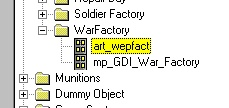  

You can name it whatever you want.... but you must fill in the `MESHPREFIX` into the corresponding field:
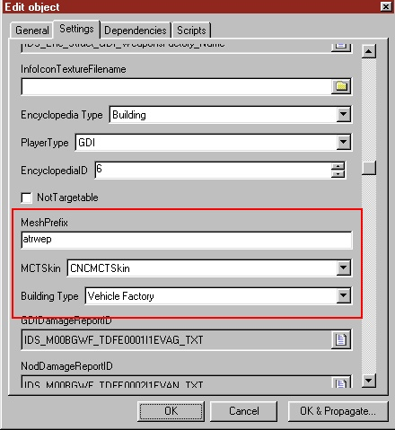

Of course you can edit other settings like health in this dialog too, play around a bit with these settings

**Have Fun by destroying all your hard work in game**

