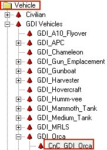

## Overview

This tutorial explains how to create capturable helipads that allow players to purchase an aircraft (such as the Orca) once captured.  
You will set up the helipad object, apply the correct scripts, and configure a terminal that spawns an aircraft above the pad.

The Helipad models and textures are in zip: [CapturableHelipads.zip](files/CapturableHelipads.zip) (or at [MPF](https://multiplayerforums.com/applications/core/interface/file/attachment.php?id=4540))

---

## 1. Create the Base Helipad Object

**Temp Object → Simple → Simple_DSAPO_Versions → Simple_MiniConsole**  
Name it: **`Capturable_GDI_Helipad`**

---

## 2. Physics Model

On the **Physics Model** tab:

Click the folder icon and browse to select the helipad model.

---

## 3. Settings Tab (Base Helipad)

Set:

- **Health:** `2`
- **HealthMax:** `500`
- **Skin:** `CNCMCTSkin`
- **ShieldType:** `CNCMCTSkin`
- **DamagePoints:** `0.750`
- **DeathPoints:** `0.000`

Assign its encyclopedia entry:

Click the **Letter icon**, choose the Helipad name from category **Enc**, set:

- **Encyclopedia Type:** `Building`

Still on the Settings tab:

- **PlayerType:** `Unteamed`
- **Radar Blip Type:** `Stationary`

---

## 4. Place the Helipad

Now **MAKE** your Helipad on the map.

---

## 5. Helipad Script

Go to **Scripts tab** for the helipad and set:

- **Type:** `z_Capturable_Helipad`
- **Name Parameter of Owner:** `-2`

Record the ID of the Helipad for later use.

---

## 6. Create the Terminal Console

Temp the **Simple_MiniConsole** and name it:`Capturable_GDI_Helipad_Terminal`

### Terminal Settings

On the Settings tab for the Terminal set

- **Skin:** `Blamo`
- **Shield Type:** `Blamo`
- **DamagePoints:** `0.000`
- **DeathPoints:** `0.000`

Next, choose the aircraft it will grant:

Click the **Letter icon**, choose the **Orca** from the **Enc** category.

Record the exact multiplayer preset name of the Orca: in our case this would be the original preset aka `CnC_GDI_Orca` (case-sensitive)

---

## 7. Create the Spawn Arrow

MAKE and position a **Daves Arrow** on TOP of the helipad.  
Move it **up on the Z-axis** until it floats approximately **3 Orcas above the helipad**.

Record the ID of the Arrow (do NOT delete the arrow):

---

## 8. Add Terminal Script

Return to **Helipad Terminal** → **Properties** → **Scripts tab**  
Add the following script:`z_Capturable_Helipad_Terminal`

With the settings below:

- **HelipadID:** ID of the helipad object (example: `100000`)
- **Preset:** The Orca preset name (`CnC_GDI_Orca`)
- **ArrowID:** The ID of the Daves Arrow (example: `100003`)
- **Cost:** `900` (Orca cost in Renegade)

End result should look like this for the Helipad Terminal:

---

## Finished Result

You're done!

