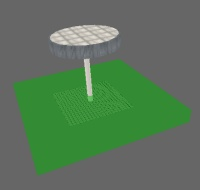
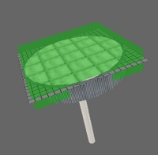
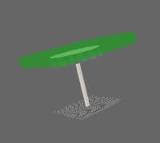
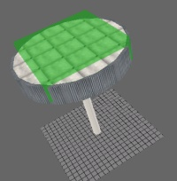

## Things to Keep in Mind About Elevators

- An elevator might cause problems if there are many elevators or if multiple players try to use the same elevator at once
- With a slow connection (e.g., 56k), **players might fall through** your elevator and pop up at the top after a few seconds
- Elevators **cannot** transport vehicles. Ensure the **Transition Zones** (explained later) are not reachable for vehicles or they will get **stuck**.
- Elevators may cause issues with beacons if you try to deploy them **on** the elevator platform.

---

## 1. Create Your Elevator

Here is a very quick example elevator:

An elevator consists of:

- **Platform** (red)
- **Door** (blue)

You may include as many details as you want, but for this tutorial we keep things simple.

Always create your elevator **centered** in RenX/Gmax.

To help estimate size, Single Player elevators are approximately:

- **Length:** 6m
- **Width:** 6m
- **Height:** 12m

You can create a reference box to compare:

(My elevator is slightly oversized here, but this is only to get a general idea.)

---

## 2. Create the Collision “Cages”

Because the **Renegade engine does not like textured objects that move**, we create collision-only cages.

These are just untextured meshes that define where players collide.

Enable **W3D Hide** and collision settings for:

- Vehicle
- Camera
- Projectile

Do NOT enable collision on the textured meshes.

---

## 3. Animation Setup

An elevator has **3 animation stages**.

### Stage 1 — Base Frame
Move all your parts of the elevator so it is on the Top-Part, with the door open for entry at the Top:

As you can see I just moved the whole platform up, and lowered the ring so that the player can enter the elevator at the top.

---

### Stage 2 — Moving Animation
Click the **Animate** button:

- Go to **Frame 1**, move your door so it is closed (you can use more than one frame if needed, just note this frame somewhere)
- Go to **Frame 10**, move elevator to **bottom** with the door closed (same comment as before for the close door)

Write down this bottom frame — you will need it later.

---

### Stage 3 — Final Animation
Animate the **bottom door opening**.

My example ends at **Frame 11**, but your animation can use more frames.

Once you are finished, deactivate animation mode and feel good that the work is nearly done.

---

## 4. Export the Elevator

Export the elevator to your Modpacket as:
- **Hierarchy Animated Model**
- Frame **0 through final frame** (e.g., 11)

---

## 5. Add It in LevelEdit

Open LevelEdit (Commando), go to **Tiles**, click **Add**.

Now enter a name, e.g. `my_elevator`, and switch to the Settings Tab. Set:

- **Type:** `ElevatorPhys`

Select your W3D and change
- **Collision Mode:** `STOP`
- **Animation Mode:** `Manual`

### Frame Values to Set

Scroll a bit down and set

| Setting                   | Meaning                                        |
|---------------------------|------------------------------------------------|
| **DoorClosedTop**         | Frame where top door is closed (Frame 1)       |
| **DoorOpeningBottom**     | Frame where bottom door is open (Frame 11)     |
| **ElevatorStartTop**      | Usually Frame 0                                |
| **ElevatorStoppedBottom** | Elevator at bottom with door closed (Frame 10) |

Set **CloseDelay** to how long the elevator should take to go up/down and press OK.

---

## 6. Setup the Elevator Zones

Select your elevator again → **Mod** → **Zones** tab.

You will find **4 zones**:

- **LowerCallZone** — Player stands here to call elevator down
- **LowerInsideZone** — Player inside → elevator starts going up
- **UpperCallZone** — Same as lower, but at top
- **UpperInsideZone** — Inside at top → elevator moves down

Double-click any zone to edit its size / position as needed:

You can toggle between the first/last frame to align zones properly. Adjust now all zones like it is explained above.

### Example Zones

Here are mine

| Zone          | Image                                | Zone            | Image                              |
|---------------|--------------------------------------|-----------------|------------------------------------|
| LowerCallZone |  | LowerInsideZone |  |
| UpperCallZone |  | UpperInsideZone |  |

Press **OK** when zones are correct.

---

## 7. Place the Elevator in Your Level

Load your level → select the elevator → click **Add** and it will appear on the map.

Export your map and test the elevator.

---

## 8. Done!

Congratulation! You can now go up and down with your elevator as long as you want.

