## Required Files

The Repair Pad models and textures are included in: [CapturableRepairpads.zip](files/CapturableRepairpads.zip) (or at [MPF](https://multiplayerforums.com/applications/core/interface/file/attachment.php?id=4527))

---

## 1. Create the Repair Pad Preset

TEMP a preset under: `Object → Simple → Simple_DSAPO_Versions → Simple_MiniConsole`

Name it **`Capturable_GDI_Repairpad`**.

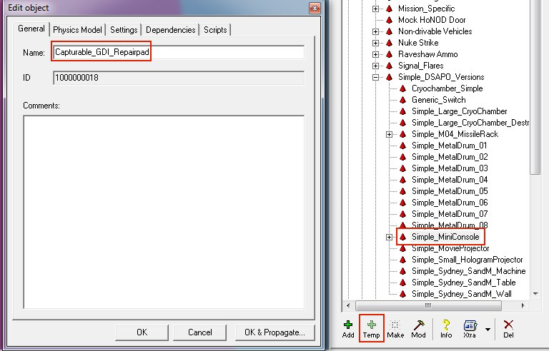

---

## 2. Assign the Model

Open the **Physics** tab:

- Click the folder icon next to the model field
- Browse to the provided Repair Pad model
- Click **Open**

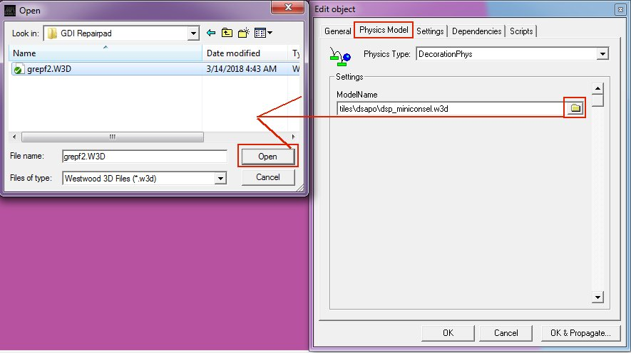

---

## 3. Configure Settings

Set the following values:

- **Health:** `2`
- **MaxHealth:** `300`
- **Shield / ShieldMax:** `0.000`
- **Skin:** `CNCMCTSkin`
- **Shield Type:** `CNCMCTSkin`

Set the **TranslatedNameID**:

- Click the letter icon
- Go to **Enc**
- Select the entry for **Repair Facility**
- Set **Encyclopedia Type** → `Building`

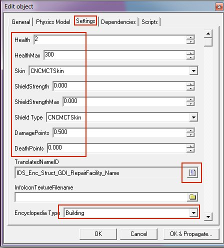

Still on the **Settings** tab:

- **PlayerType:** `Unteamed`
- **Radar Blip Type:** `Stationary`

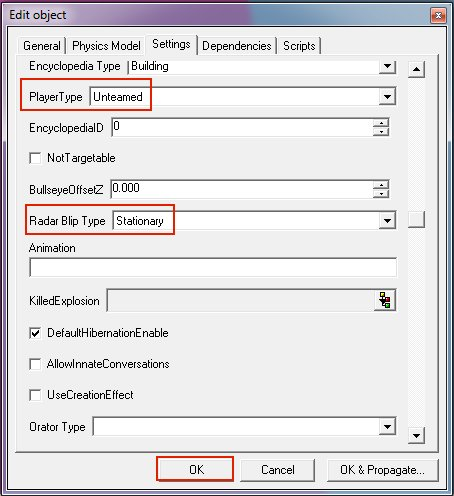

---

## 4. Place the Repair Pad in the Level

Click **MAKE** to create the object in your level.

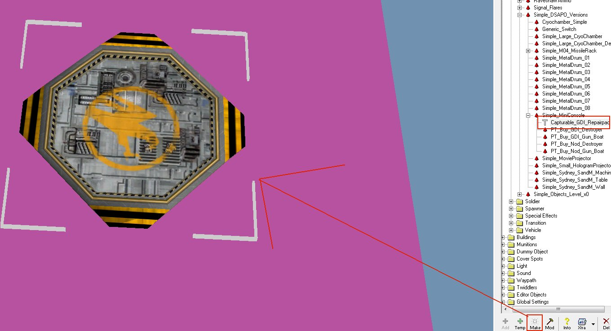

---

## 5. Create a Script Zone

Navigate to: `Object → Script Zone → Script_Zone_All`

Click **MAKE**, then position the zone directly on top of your Repair Pad.

To adjust its height:

- Hold **SHIFT**
- Drag the black handles up/down to resize the zone

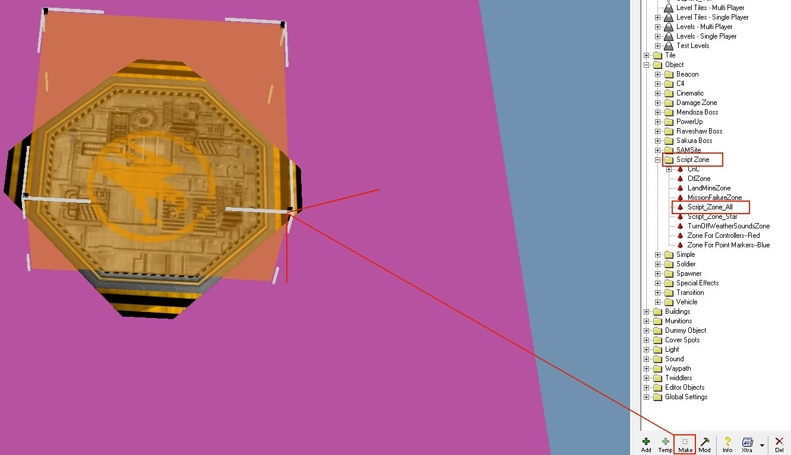

Open the **properties** of the Repair Pad.  
Record its **ID**—in this example: `100000`
Then open the **zone properties**, and record its **ID**—here: `100001`

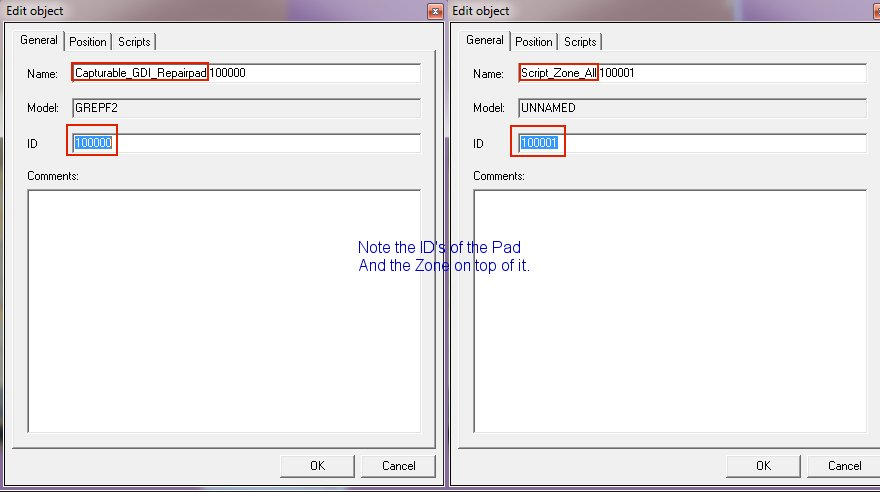

---

## 6. Add the Capturable Script to the Repair Pad

Open the properties of the Repair Pad and switch to the **Scripts** tab.

Add the script: `z_Capturable_Repairpad`

Set:
- **Name:** `owner` 
- **value:** `-2` (unteamed)
- **Name:** `RepairZoneID `
- **value:** (the ID of the zone you created, e.g., `100001`)

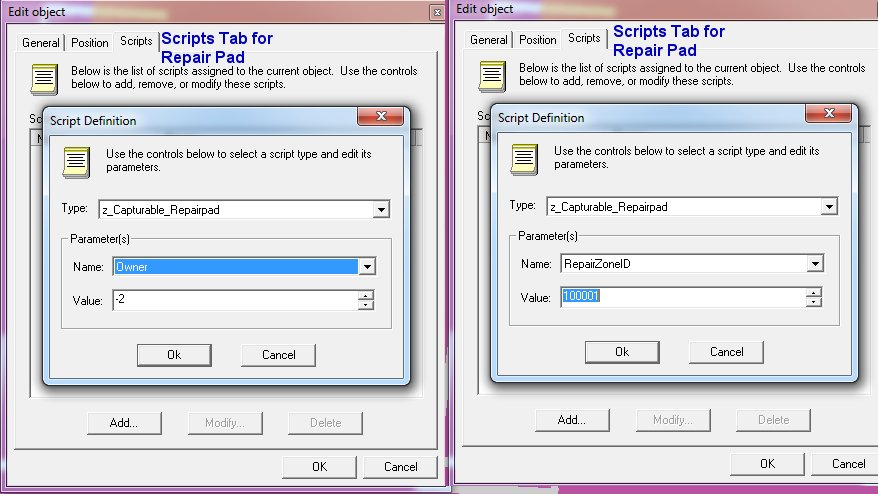

End result should look like this for the repair pad:

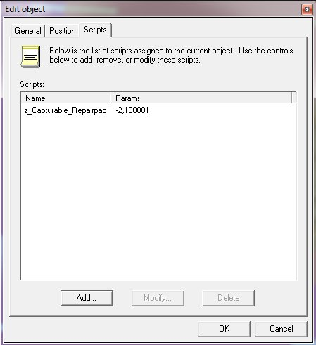

---

## 7. Add the Zone Script

Open the properties of the `Script_Zone_All` that you placed on top of your Repairpad and switch to the **Scripts** tab.

Add the script: `z_Capturable_Repairzone`

Set:
- **Name:** `RepairPadID`
- **value:** (the ID of the Repair Pad you created, e.g., `100000`)

- 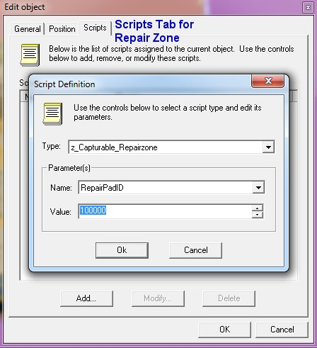

End result for the zone should look similar to this:

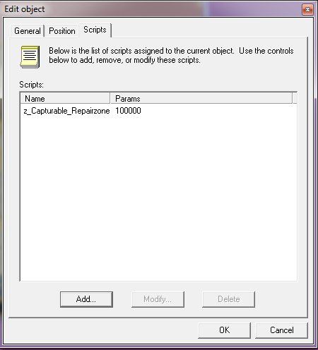

---

## 8. Final Steps

Save your level. You now have a fully **capturable Repair Pad** in-game.
Repeat the same process for the **Nod** version using the Nod Repair Pad model.

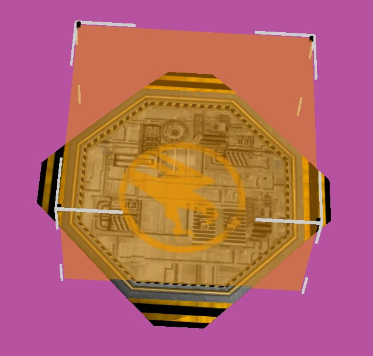

